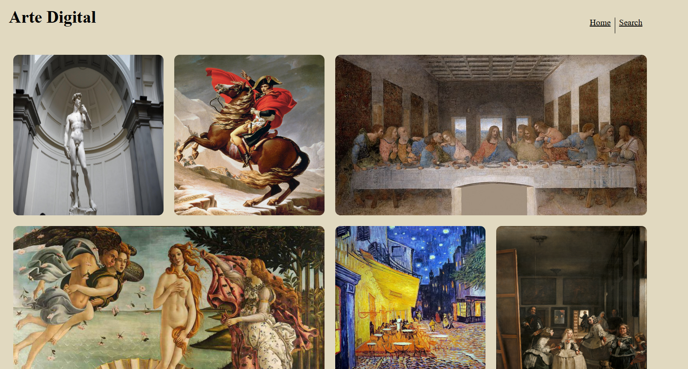
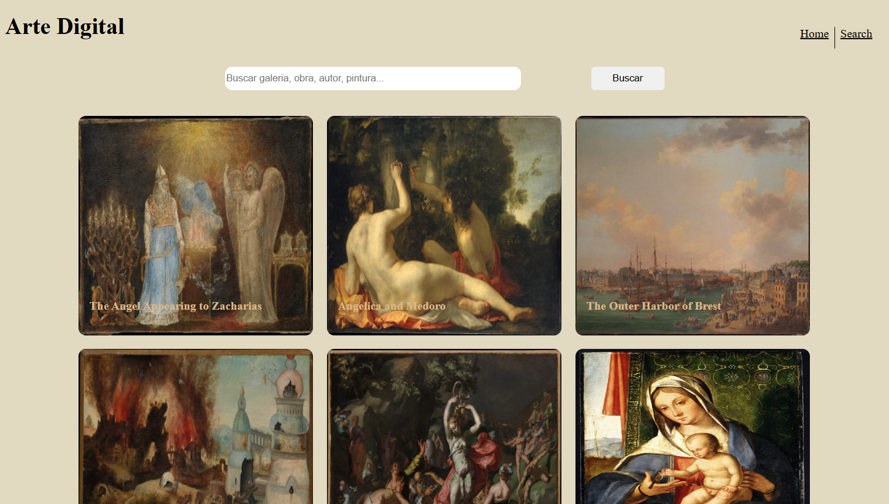

<h1 align="left">Web-Art</h1>

###

<h2 align="left">Proyecto final TripleTen</h2>

###

<h2 align="left">De que trata</h2>

###

Arte digital es una plataforma diseñada para dar visibilidad a galerías de arte e historia, en colaboracion con el Museo Metropolitano de Arte que ofrece conjuntos de datos selectos con información sobre más de 470.000 obras de arte de su Colección para uso comercial de más de 5000 años de arte de todo el mundo para que todos puedan experimentarlo y disfrutarlo.

###

<h2 align="left">Link del proyecto: https://joseeduardotrevizo.github.io/Web_art/</h2>

###

  
  
  
  
  
  
  

###
